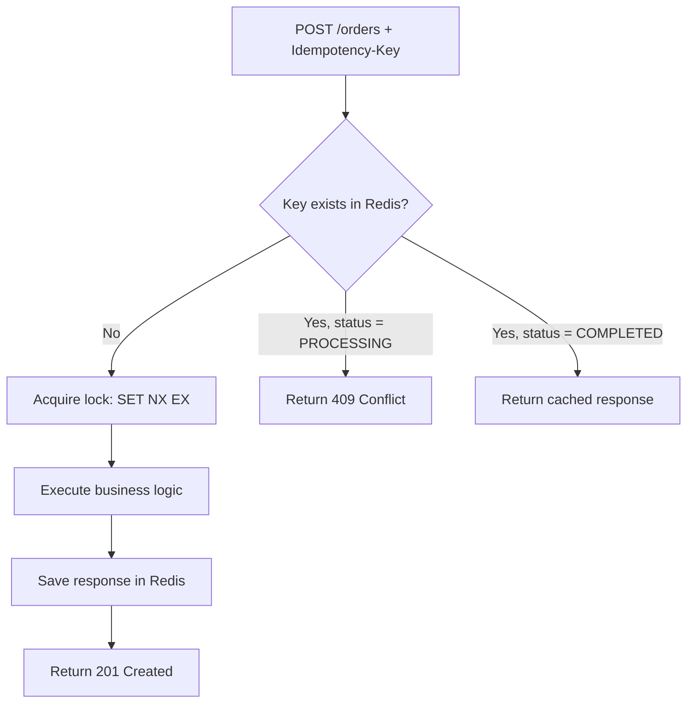

# Idempotent Orders API

A hands-on backend project demonstrating how to implement **Idempotency Keys** in a REST API using Node.js, TypeScript, Express, Prisma, and Redis — solving the classic "duplicate request" problem that occurs with network retries.

---

## 📌 The Problem

`POST` requests are **not idempotent by design**. If a client sends the same "create order" request twice — whether due to a network timeout, an accidental double-click, or an automatic retry — the server has no built-in way to know whether this is:

- A **technical duplicate** (the same intent, repeated due to a network issue), or
- A **genuine new request** (the user actually wants to place a second order)

Without any additional context, a naive API will create **two separate orders** for what was meant to be a single action — leading to duplicate charges, duplicate shipments, or inconsistent data.

This project demonstrates the problem first (baseline), then fixes it using the **Idempotency Key** pattern.

---

## ✅ The Solution

Clients send a unique `Idempotency-Key` header with each request. The server:

1. Tries to atomically acquire a "lock" on that key in Redis using `SET key value NX EX ttl`
2. If the key is new → proceeds with the operation normally
3. If the key already exists and the original request is **still processing** → returns `409 Conflict`
4. If the key already exists and the original request **completed** → returns the **exact same cached response**, without re-executing any business logic



### Why Redis?

Redis's `SET NX EX` command performs the "check if it exists" and "store it" steps as a **single atomic operation**. This eliminates the race condition that would occur if two identical requests arrived at the exact same millisecond — a scenario that's much harder to guard against safely using a plain SQL `SELECT` + `INSERT`.

---

## 🏗️ Architecture

The project follows a **modular, domain-driven structure** — each feature is a self-contained module with its own routes, controller, service, and repository layers.

```
idempotent-orders-api/
├── prisma/
│   └── schema.prisma
├── src/
│   ├── config/
│   │   ├── prisma.client.ts
│   │   └── redis.client.ts
│   ├── middlewares/
│   │   └── idempotency.middleware.ts
│   ├── modules/
│   │   ├── idempotency/
│   │   │   ├── idempotency.repository.ts
│   │   │   ├── idempotency.service.ts
│   │   │   └── idempotency.types.ts
│   │   └── orders/
│   │       ├── orders.controller.ts
│   │       ├── orders.repository.ts
│   │       ├── orders.routes.ts
│   │       ├── orders.service.ts
│   │       └── orders.types.ts
│   ├── app.ts
│   └── server.ts
├── .env.example
├── tsconfig.json
└── package.json
```

| Layer | Responsibility |
|---|---|
| **Routes** | Map URLs to controller functions |
| **Controller** | Handle HTTP request/response only — no business logic |
| **Service** | Contains business logic and orchestrates repositories |
| **Repository** | Talks to the database/Redis only — no business logic |

---

## 🛠️ Tech Stack

- **Node.js** + **TypeScript**
- **Express** — HTTP framework
- **Prisma** + **PostgreSQL** — persistent storage for orders
- **Redis** (`ioredis`) — atomic idempotency key store with built-in TTL

---

## 🚀 Getting Started

### Prerequisites

- Node.js (v18+)
- PostgreSQL running locally
- Redis running locally (via Docker recommended)

### 1. Clone the repository

```bash
git clone https://github.com/Moaz-ashraf1/idempotent-orders-api.git
cd idempotent-orders-api
```

### 2. Install dependencies

```bash
npm install
```

### 3. Set up environment variables

```bash
cp .env.example .env
```

Edit `.env` with your local PostgreSQL and Redis connection details.

### 4. Start Redis (via Docker)

```bash
docker run -d --name redis-idempotency -p 6379:6379 redis:7-alpine
```

### 5. Run database migrations

```bash
npx prisma migrate dev
```

### 6. Start the development server

```bash
npm run dev
```

The API will be available at `http://localhost:3000`.

---

## 📡 API Usage

### Create an order (protected by Idempotency Key)

```http
POST /api/orders
Content-Type: application/json
Idempotency-Key: a-unique-client-generated-key

{
  "product": "Laptop",
  "quantity": 1
}
```

**First request** → creates the order, returns `201 Created`.

**Retry with the same `Idempotency-Key`** → returns the **exact same response** (same order `id`), without creating a duplicate order.

**Retry with the same key while the first request is still processing** → returns `409 Conflict`.

### List all orders

```http
GET /api/orders
```

---

## 🧪 What This Project Demonstrates

- The real-world difference between a **technical duplicate** (retry) and a **business duplicate** (genuine new intent)
- Why `POST` is not idempotent by default, unlike `GET` or `PUT`
- How to use Redis's atomic `SET NX EX` to safely handle race conditions
- A clean separation of concerns using the Controller → Service → Repository pattern
- Why idempotency is a **technical/API-layer concern**, while preventing duplicate business orders is a **separate business-logic decision**

---

## 👤 Author

**Moaz**
Junior Backend Developer | Node.js · TypeScript · Express · Prisma · PostgreSQL
[GitHub](https://github.com/Moaz-ashraf1) · [LinkedIn](https://linkedin.com/in/moaz-ashraf-abdelghany)
