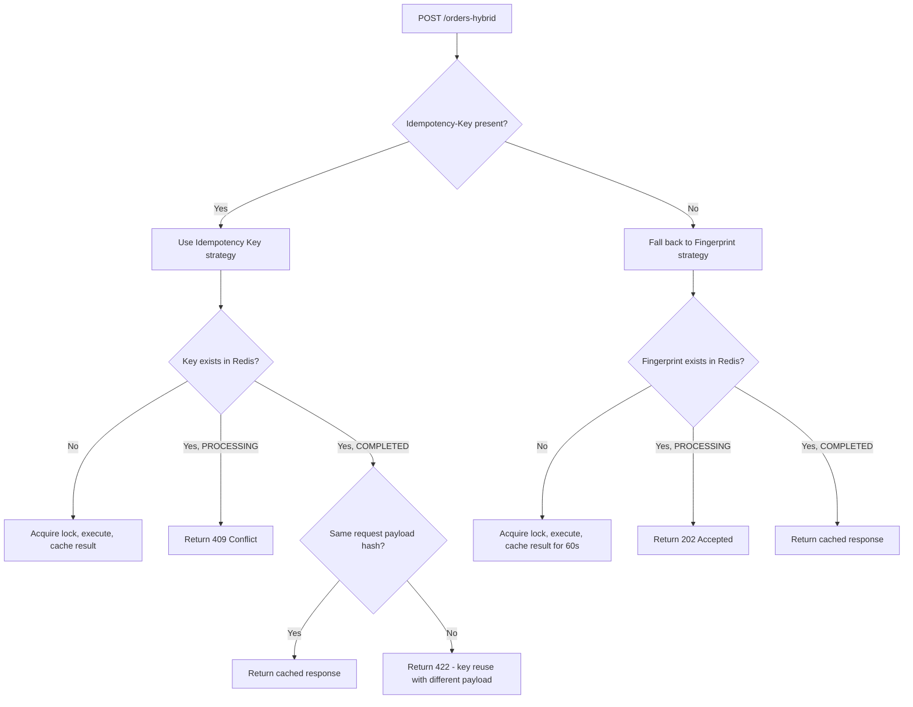

# Idempotent Orders API

A hands-on backend project demonstrating three different strategies for solving the "duplicate request" problem in REST APIs: **Idempotency Keys**, **Server-side Fingerprinting**, and a **Hybrid** approach that combines both. Built with Node.js, TypeScript, Express, Prisma, and Redis.

---

## 📌 The Problem

`POST` requests are **not idempotent by design**. If a client sends the same "create order" request twice — whether due to a network timeout, an accidental double-click, or an automatic retry — the server has no built-in way to know whether this is:

- A **technical duplicate** (the same intent, repeated due to a network issue), or
- A **genuine new request** (the user actually wants to place a second order)

Without any additional protection, a naive API will create **two separate orders** for what was meant to be a single action — leading to duplicate charges, duplicate shipments, or inconsistent data.

This project demonstrates the problem first (baseline), then solves it using three progressively more sophisticated approaches.

---

## ✅ Three Strategies Implemented

### 1. Idempotency Key (Client-generated)

The client sends a unique `Idempotency-Key` header with each request. The server atomically locks that key in Redis, executes the operation once, and replays the cached response for any retry using the same key.

- **Guaranteed accuracy** — the client explicitly states "this is the same operation"
- Requires client cooperation
- Protected for 24 hours (configurable TTL)
- Includes **request payload hash validation**: if the same key is reused with a _different_ request body, the server rejects it with `422 Unprocessable Entity` instead of silently returning the wrong cached response — this catches a subtle class of client-side bugs.

### 2. Request Fingerprint (Server-side)

No client cooperation required. The server computes a SHA-256 hash from the meaningful fields of the request body (with basic canonicalization — trimming and lowercasing) and uses it as the deduplication key, valid for a short time window (60 seconds).

- Works even with clients that don't support the Idempotency-Key pattern
- **Best-effort, not guaranteed** — it's a probabilistic decision based on how "similar" and how "recent" two requests are
- Carries a risk of false positives: a user placing the same order twice _intentionally_ within the time window will be blocked

### 3. Hybrid Strategy (Recommended)

Combines both: if the client sends an `Idempotency-Key`, the server uses the guaranteed key-based approach. If not, it automatically falls back to fingerprint-based detection — ensuring every client gets some level of protection, even legacy or third-party integrations that don't send the header.



---

## 🏗️ Architecture

The project follows a **modular, domain-driven structure** — each feature is a self-contained module with its own routes, controller, service, and repository layers.

```
idempotent-orders-api/
├── prisma/
│   └── schema.prisma
├── src/
│   ├── config/
│   │   ├── prisma.client.ts
│   │   └── redis.client.ts
│   ├── middlewares/
│   │   ├── idempotency.middleware.ts
│   │   ├── fingerprint.middleware.ts
│   │   └── hybrid.middleware.ts
│   ├── modules/
│   │   ├── idempotency/
│   │   │   ├── idempotency.repository.ts
│   │   │   ├── idempotency.service.ts
│   │   │   └── idempotency.types.ts
│   │   ├── fingerprint/
│   │   │   ├── fingerprint.repository.ts
│   │   │   ├── fingerprint.service.ts
│   │   │   └── fingerprint.types.ts
│   │   └── orders/
│   │       ├── orders.controller.ts
│   │       ├── orders.repository.ts
│   │       ├── orders.routes.ts
│   │       ├── orders.service.ts
│   │       └── orders.types.ts
│   ├── app.ts
│   └── server.ts
├── .env.example
├── tsconfig.json
└── package.json
```

| Layer          | Responsibility                                        |
| -------------- | ----------------------------------------------------- |
| **Routes**     | Map URLs to controller functions                      |
| **Controller** | Handle HTTP request/response only — no business logic |
| **Service**    | Contains business logic and orchestrates repositories |
| **Repository** | Talks to the database/Redis only — no business logic  |

---

## 🛠️ Tech Stack

- **Node.js** + **TypeScript**
- **Express** — HTTP framework
- **Prisma** + **PostgreSQL** — persistent storage for orders
- **Redis** (`ioredis`) — atomic lock acquisition (`SET NX EX`) with built-in TTL for both idempotency keys and fingerprints

---

## 🚀 Getting Started

### Prerequisites

- Node.js (v18+)
- PostgreSQL running locally
- Redis running locally (via Docker recommended)

### 1. Clone the repository

```bash
git clone https://github.com/Moaz-ashraf1/idempotent-orders-api.git
cd idempotent-orders-api
```

### 2. Install dependencies

```bash
npm install
```

### 3. Set up environment variables

```bash
cp .env.example .env
```

Edit `.env` with your local PostgreSQL and Redis connection details.

### 4. Start Redis (via Docker)

```bash
docker run -d --name redis-idempotency -p 6379:6379 redis:7-alpine
```

### 5. Run database migrations

```bash
npx prisma migrate dev
```

### 6. Start the development server

```bash
npm run dev
```

The API will be available at `http://localhost:3000`.

---

## 📡 API Usage

### 1. Idempotency Key — `POST /api/orders`

```http
POST /api/orders
Content-Type: application/json
Idempotency-Key: a-unique-client-generated-key

{
  "product": "Laptop",
  "quantity": 1
}
```

- **First request** → creates the order, returns `201 Created`.
- **Retry with the same key + same payload** → returns the exact same cached response.
- **Retry with the same key while still processing** → `409 Conflict`.
- **Reuse the same key with a _different_ payload** → `422 Unprocessable Entity`.

### 2. Fingerprint — `POST /api/orders-fingerprint`

```http
POST /api/orders-fingerprint
Content-Type: application/json

{
  "product": "Laptop",
  "quantity": 1
}
```

- No header required. The server hashes the request body and deduplicates automatically for 60 seconds.
- Identical request within 60 seconds → returns the same cached response.
- Identical request while still processing → `202 Accepted`.
- Same request after the 60-second window → treated as a new order.

### 3. Hybrid — `POST /api/orders-hybrid`

Uses the Idempotency-Key strategy if the header is present, otherwise automatically falls back to Fingerprint-based protection. Same request/response shape as above, depending on which path is taken.

### List all orders

```http
GET /api/orders
```

---

## 🧪 What This Project Demonstrates

- The real-world difference between a **technical duplicate** (retry) and a **business duplicate** (genuine new intent) — and why idempotency only solves the first one
- Why `POST` is not idempotent by default, unlike `GET` or `PUT`
- How to use Redis's atomic `SET NX EX` to safely handle race conditions where two identical requests arrive at the same millisecond
- The trade-offs between a client-guaranteed approach (Idempotency Key) and a server-side best-effort approach (Fingerprint) — accuracy vs. client independence
- How to detect and reject Idempotency-Key misuse (same key, different payload) using request hash validation
- A clean separation of concerns using the Controller → Service → Repository pattern
- Why preventing duplicate _business_ orders (e.g., a user intentionally ordering the same item twice) is a separate business-logic decision, not something idempotency itself can or should solve

---

## 🔗 Related Projects

- [auth-service](https://github.com/Moaz-ashraf1/auth-service) — A standalone authentication and authorization service (JWT, Refresh Token Rotation, RBAC)

---

## 👤 Author

**Moaz**
Junior Backend Developer | Node.js · TypeScript · Express · Prisma · PostgreSQL
[GitHub](https://github.com/Moaz-ashraf1) · [LinkedIn](https://linkedin.com/in/[YOUR_LINKEDIN])
